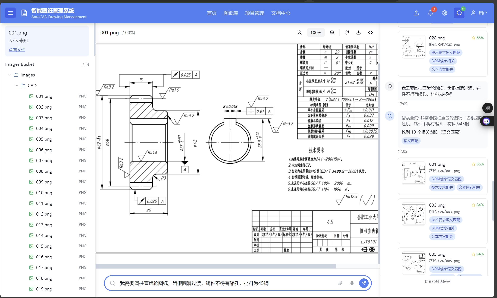

# ImagePDM

ImagePDM 是一个面向工业图纸、BOM 数据与设备资料管理场景的智能化平台，围绕“资料上传、结构化提取、语义检索、图纸查看、对话式问答”构建完整闭环。项目采用前后端分离架构，前端提供统一的人机交互界面，后端负责文件处理、数据抽取、向量检索、对象存储访问与大模型能力集成。



## 项目简介

在设备资料管理、图纸查询和 BOM 检索场景中，传统方式通常依赖人工翻阅目录、手工比对编号、逐份打开文件，效率低且容易出错。ImagePDM 通过整合 PDF 提取、设备信息管理、向量检索和智能问答能力，让用户可以直接通过序列号、关键词或自然语言快速定位图纸、设备条目和相关文件。

项目当前重点覆盖以下业务链路：

- 设备资料与图纸文件上传入库
- PDF 首页面信息提取与结构化保存
- 基于料号、合同号、供应商等字段的精确检索
- 基于文本向量的模糊检索与语义召回
- BOM 目录树浏览与文件预览
- 图纸、图片、PDF 与 3D 模型统一查看
- 基于上下文的大模型问答与辅助检索

## 核心功能

### 1. 智能检索与对话问答

- 支持通过设备序列号、物料编号等关键信息进行精确查询
- 支持向量检索，对自然语言问题进行相似设备召回
- 支持将检索结果与上下文拼接后发送给大模型，生成面向业务的自然语言回答
- 检索命中后可联动图纸查看区和 BOM 树，提高定位效率

### 2. BOM 文件管理

- 以后端对象存储目录为基础构建 BOM 树形结构
- 支持文件夹展开、关键字搜索、自动定位匹配文件
- 支持文本、图片、PDF、3D 模型等多类型文件预览
- 上传成功后可自动刷新目录树，减少重复操作

### 3. PDF 信息提取与结构化处理

- 基于 PaddleOCR 对 PDF 首页进行 OCR 识别
- 提取供应商、合同号、标签号等关键字段
- 将提取结果与文件路径、图片路径等业务信息关联保存
- 为后续精确检索、语义检索和问答增强提供数据基础

### 4. 图纸与模型查看

- 支持主视图区域展示图纸与文档内容
- 支持从聊天结果中一键跳转到关联图纸
- 支持 BOM 中定位文件并进行联动查看
- 支持 GLTF / GLB 等 3D 模型展示

### 5. 文件存储与数据管理

- 使用 MinIO 管理模型与资料文件目录
- 使用 Supabase 存储设备结构化数据
- 支持文件上传、目录结构读取、文件内容读取与图片访问

## 技术架构

### 前端

- Next.js 15
- React 19
- TypeScript
- Tailwind CSS
- shadcn/ui
- Zustand
- Axios

前端主要负责统一交互体验，核心界面包括：

- 中央主区域：图纸 / 文档展示
- 左侧侧栏：BOM 目录树与文件预览
- 右侧侧栏：AI 对话与设备信息回显
- 底部搜索入口：统一触发检索与问答流程

### 后端

- FastAPI
- Pydantic
- Supabase Python SDK
- MinIO SDK
- PaddleOCR
- sentence-transformers
- jieba

后端主要负责：

- 设备数据读写
- PDF 信息抽取
- 模型目录与文件访问
- 图像文件读取
- 大模型兼容接口封装
- 向量化与相似度检索

## 主要接口

项目后端当前围绕 `/api` 提供服务，典型接口包括：

- `GET /api/models-directory`：获取模型与文件目录结构
- `GET /api/file-content/{file_path}`：读取文件内容
- `POST /api/equipment`：保存设备信息
- `GET /api/equipment/fields`：获取设备字段定义
- `GET /api/equipment/search`：关键字检索设备信息
- `GET /api/equipment/search-by-artno`：按料号精确检索
- `POST /api/equipment/vector-search`：语义向量检索
- `POST /api/llm`：大模型问答
- `POST /api/v1/chat/completions`：OpenAI 兼容聊天接口
- `GET /api/v1/models`：获取可用模型列表
- `POST /api/upload-to-supabase`：上传文件到存储
- `POST /api/extract-pdf-info`：提取 PDF 关键信息
- `POST /api/process-pdf-folder`：批量处理文件夹中的 PDF
- `GET /api/images/{file_path}`：读取图片资源

## 项目结构

```text
ImagePDM/
├─ backend/                 # FastAPI 后端
│  ├─ app.py                # 主应用与接口实现
│  ├─ api.py                # 基础接口示例
│  ├─ requirements.txt      # Python 依赖
│  ├─ data/                 # 本地模型与数据资源
│  └─ utils/                # OCR、向量检索、MinIO 工具
├─ frontend/                # Next.js 前端
│  ├─ app/                  # App Router 入口
│  ├─ components/           # 页面与业务组件
│  ├─ hooks/                # 自定义 Hook
│  └─ lib/                  # 状态管理与工具函数
├─ docs/
│  └─ assets/               # README 配图等文档资源
└─ README.md
```

## 运行方式

### 1. 后端启动

进入后端目录并安装依赖：

```bash
cd backend
pip install -r requirements.txt
```

配置环境变量，参考：

[`backend/.env.example`](/e:/project/ImagePDM/backend/.env.example)

启动 FastAPI 服务：

```bash
uvicorn app:app --reload --host 0.0.0.0 --port 8000
```

### 2. 前端启动

进入前端目录并安装依赖：

```bash
cd frontend
npm install
```

启动开发环境：

```bash
npm run dev
```

默认访问地址：

- 前端：`http://localhost:3000`
- 后端：`http://localhost:8000`

## 环境依赖说明

项目运行通常需要具备以下外部依赖或服务：

- Supabase：存储设备结构化数据
- MinIO：存储图纸、模型和资料文件
- DashScope 或自定义大模型服务：提供问答与推理能力
- PaddleOCR 相关运行环境：用于 PDF 信息识别

常见环境变量包括：

- `SUPABASE_URL`
- `SUPABASE_KEY`
- `DASHSCOPE_API_KEY`
- `MINIO_ENDPOINT`
- `MINIO_ACCESS_KEY`
- `MINIO_SECRET_KEY`
- `CUSTOM_LLM_URL`
- `CUSTOM_LLM_API_KEY`
- `CUSTOM_LLM_MODEL`
- `USE_CUSTOM_LLM`

## 业务流程

### 文件入库流程

1. 用户在前端选择文件或文件夹上传
2. 后端将文件写入对象存储
3. 若检测到 PDF，则触发信息提取逻辑
4. 抽取后的结构化字段写入业务数据表
5. 前端自动刷新 BOM 树并支持继续检索

### 智能检索流程

1. 用户在底部搜索栏输入设备编号或自然语言问题
2. 前端优先发起精确检索
3. 若未命中，再调用向量检索进行模糊召回
4. 后端拼接设备上下文并调用大模型生成回答
5. 前端同步展示问答结果、设备信息表格和关联图纸

## 认证与安全设计

平台已实现基于 JWT 的用户认证与接口鉴权机制，用于保障用户身份可信、接口访问受控以及核心业务数据安全。用户登录成功后由后端签发 Access Token，前端在后续请求中通过请求头携带 Token 访问受保护接口，后端再通过中间件或依赖注入方式完成 Token 校验。

当前认证与安全能力包括：

- 基于 JWT 实现用户登录认证
- 登录成功后签发 Access Token 用于后续接口访问
- 前端在请求头中携带 Token 调用受保护接口
- 后端校验 Token 的合法性、有效期与签名信息
- 支持 Token 过期处理与刷新机制
- 对上传接口、设备写入接口、管理类接口进行访问保护
- 为多用户协作场景提供统一的安全访问基础

## 项目亮点

- 将图纸管理、BOM 浏览、智能检索与问答能力集成到同一平台
- 支持“精确检索 + 语义检索 + 大模型总结”的复合查询链路
- 具备 PDF OCR 抽取与结构化存储能力，能从非结构化资料中沉淀可检索数据
- 支持图纸、图片、文本、3D 模型的统一查看与联动操作
- 已实现 JWT 鉴权机制，能够支撑受保护接口的安全访问

## 后续优化方向

- 增强 JWT 认证体系，例如细化角色权限与更完整的刷新策略
- 增加用户、角色、权限管理模块
- 完善接口异常处理与统一日志体系
- 增加 Docker 化部署与一键启动脚本
- 增加单元测试、接口测试与端到端测试
- 优化 OCR 提取规则与字段识别准确率

## 说明

- 仓库中的环境变量文件不应提交到版本控制，推荐使用 `.env.example` 维护配置模板
- 若用于课程设计、毕业设计或项目展示，建议配合系统架构图、流程图和模块图一起说明
- 若你需要面向答辩、简历或比赛场景进一步润色，我也可以继续帮你改成“项目介绍版”或“论文式说明版”
